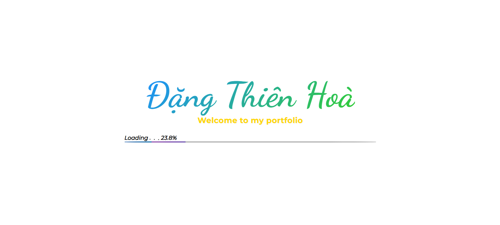
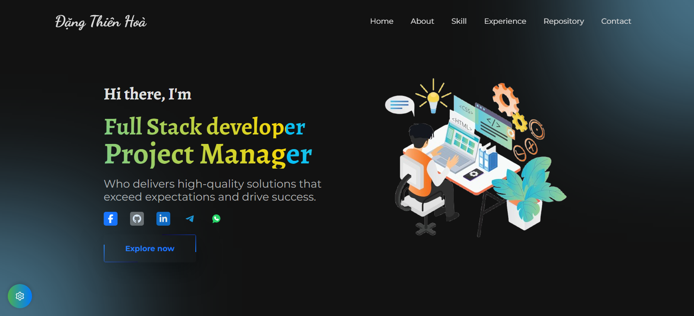

### Đặng Thiên Hoà'S RESUME
Deployment: https://hightech99.github.io/resume

## Preview

## Installation

### 1. Clone git repository:
    
    git clone https://github.com/hightech99/Resume.git
 
### 2. Yarn install:

    cd your-dir/resume
    yarn install

### 3. Set mail config:

   - Create file "src/mail/config.json"
   - Copy file content from "src/mail/config.dev.json" to "src/mail/config.json"

    {
        "mailService": "MAIL SERVICE FROM EMAILJS",
        "mailThankYouTemplate": "TEMPLATE FROM EMAILJS",
        "mailFeedbackTemplate": "TEMPLATE FROM EMAILJS",
        "publicKey": "PUBLIC KEY FROM EMAILJS"
    }

   - Edit config file "src/mail/config.json" using your EmailJS Config
   
### 4. Start
    yarn start
